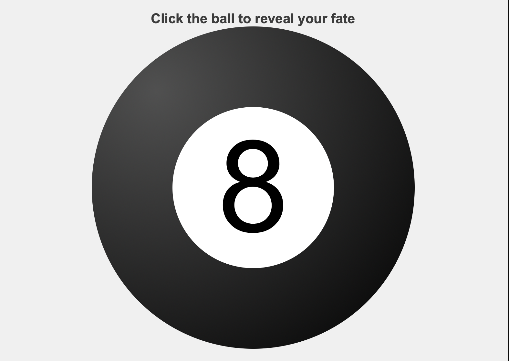
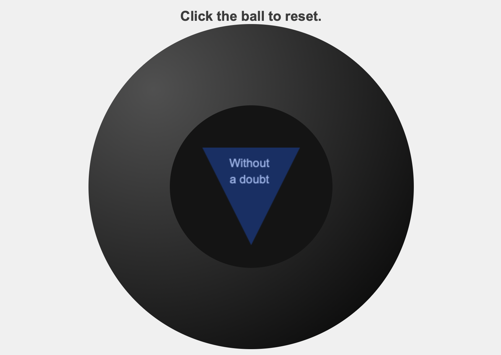

# magic8
This is a magic 8 ball program that I wrote to learn/experiment with Javascript.

A live implementation can be found [here](http://acsweb.ucsd.edu/~nonguyen/)
on my personal website

Screen shots:

Desired outcome:
- Gain more experience with Javascript/JQuery/HTML/CSS
- Gain more experience with improving methods to improve scalability.
- Gain more experience with version control (GIT) software.

File List:
- index.html -- The playground html file for hosting the javascript file.
- phrases -- List of magic 8 ball strings used in production.  
- style.css -- Web page styling for magic eight ball.
- magic.js -- Main driver for magic eight ball functionality.

References:

Used to understand radial-gradients.
    https://modernweb.com/css-spheres-2/

How to draw in an html canvas
    https://www.kirupa.com/html5/drawing_triangles_on_the_canvas.htm

Main JQuery API
    https://api.jquery.com/
